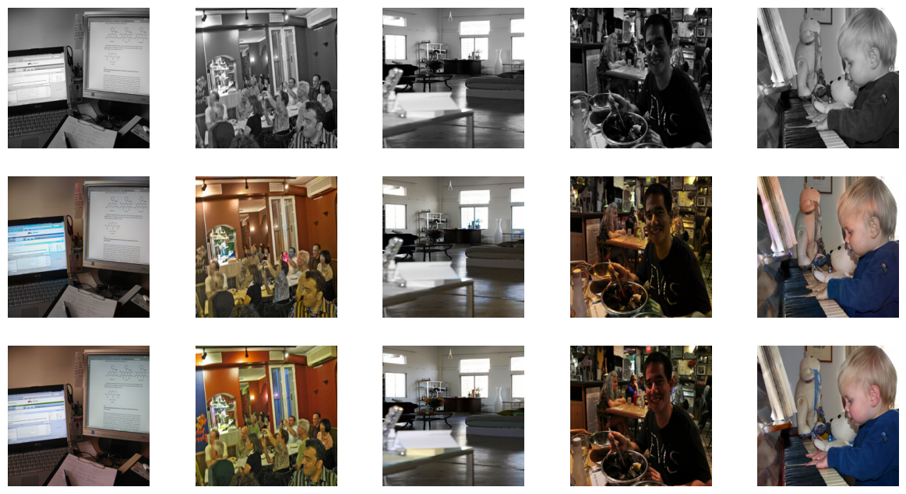
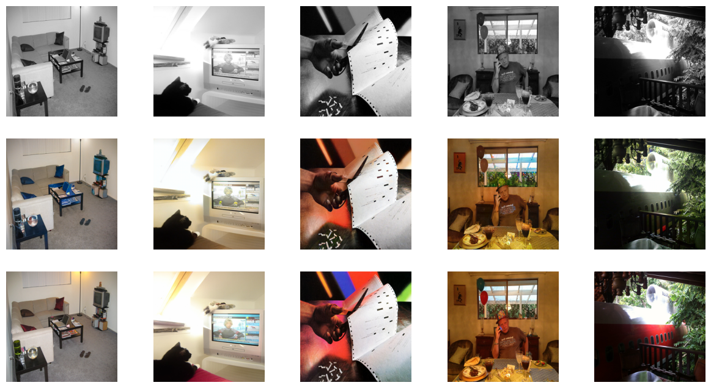

# Image Colorizer

## Description
This is a simple image colorizer using a GAN based Unet created in Pytorch. The mode was trained on the COCO dataset 
which is a dataset of about 20,000 images. The model was trained for 100 epochs and the results are shown below.
 
## Architecture

The model was trained using a GAN that has a discriminator and a generator. The generator is a Unet that takes in an 
image in the form of a tensor and outputs a tensor of the same size. This set is trained on a size of 256x256. 

## Results

The results are shown below. The model was trained for 100 epochs and the results are shown below. The top image is 
the black and white image and the bottom image is the original image. The image in the middle is the colorized image 
generated by the GAN




```
loss_D_fake: 0.30319
loss_D_real: 0.29751
loss_D: 0.30035
loss_G_GAN: 2.98513
loss_G_L1: 6.07848
loss_G: 9.06361
```